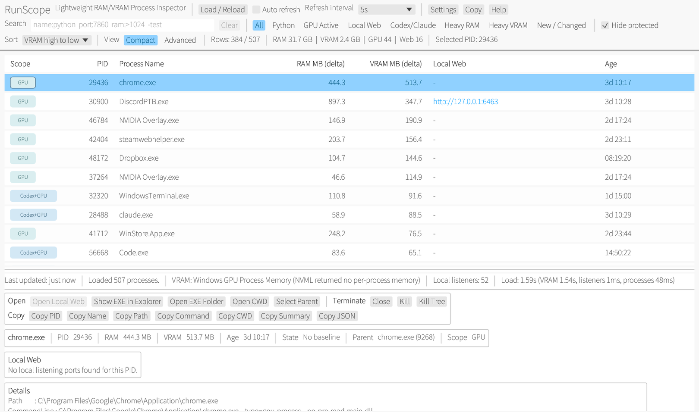

# RunScope

[日本語](#runscope) / [English](#runscope-english) / [日本語 standalone](README.ja.md)

Windows向けの軽量RAM/VRAMプロセスインスペクターです。

RunScopeは、実行中プロセスのRAM、NVIDIA VRAM、ローカルWeb UI候補を手動で確認するための小さなネイティブデスクトップツールです。AI、Python、ComfyUI、Forge、Ollama、Node、VS Code、ターミナル、WSL、Codex/Claude系ツールを使った作業後のプロセス整理を想定しています。

このアプリはデフォルトで手動ロード方式です。起動直後にプロセス収集せず、UIフレームごとの監視もしません。MVPではCPU使用率も取得しません。最新の状態を見たいときだけ `Load / Reload` を押します。

## スクリーンショット



スクリーンショットは `Load / Reload` 後に実際のプロセス一覧を表示している画面例です。

## 目的

ローカルAIや開発ツールは、Pythonサーバー、WebUI、ターミナル配下の子プロセス、Node開発サーバー、モデル実行プロセス、GPUジョブなどを残すことがあります。Windowsのタスクマネージャーでも一部は確認できますが、次のような判断には最適化されていません。

- どのプロセスがRAMやVRAMを使っているか
- そのプロセスがターミナル、VS Code、WSL、Codex、Claude、Python、WebUI系のツリーに属しているか
- 終了前に、そのプロセスがlocalhostで何かを開いていないか
- 対象PID一覧を確認してから、単体またはプロセスツリーごと終了できるか

RunScopeは、このプロセス整理ワークフローに絞っています。

## かんたんダウンロード

Rust環境がない場合は、GitHub Releasesからzipをダウンロードしてください。

[Latest Release](https://github.com/AiWithYou/RunScope/releases/latest)

1. `RunScope-windows-x64.zip` をダウンロードします。
2. zipを展開します。
3. `RunScope.exe` を起動します。
4. 起動後、`Load / Reload` を押してプロセス一覧を読み込みます。

`SHA256SUMS.txt` でダウンロードしたexe/zipのSHA256を確認できます。

Windowsの警告が出る場合があります。これは個人ビルドの未署名exeでよく出る警告です。入手元がこのリポジトリのReleaseであることを確認してから実行してください。

## 主な機能

- `Load / Reload` による手動スナップショット取得
- 任意のAuto refresh、デフォルトOFF
- 前回スナップショットとの差分（New / Changed / Exited、RAM / VRAM増減）
- RAM表示、既知VRAM表示、表示中プロセスの合計値
- `http://127.0.0.1:7860` のようなローカルTCP待ち受けURL候補の表示
- テーブル上の `Local Web` クリックでブラウザ起動、右クリックでURLコピー
- Compact / Advanced テーブル表示切り替え
- 1000件以上でも軽くスクロールできる表示範囲のみのテーブル描画
- プロセス一覧と下部詳細パネルの高さをドラッグで変更
- 親PIDと親プロセス名の表示
- プロセス年齢、実行ファイルパス、コマンドライン、CWD、仮想メモリの詳細表示
- RAM / VRAM / 増加量 / 名前 / PID / 年齢の12種類のソートとクリック可能な列見出し
- 通常検索に加え、`name:`、`port:`、`ram:>`、除外語などの構造化Search
- ANDで組み合わせられるQuick filters: `Python`、`GPU Active`、`Local Web`、`Codex/Claude`、`Heavy RAM`、`Heavy VRAM`、`New / Changed`
- 保護対象プロセスの非表示
- 表示中テーブルのTSV、PID一覧、選択プロセスJSON、診断情報のクリップボードコピー
- `Close`、`Kill`、`Kill Tree`
- 行右クリックメニューから `Open Local Web`、PID/名前/Path/Command Line/CWDコピー、終了操作
- 詳細パネルからEXE/CWDを開く、親・子プロセスへ移動、summary/JSONコピー
- `Close` / `Kill` / `Kill Tree` 前の対象PID、RAM/VRAM合計、Local Web数の確認
- 編集可能な追加保護リストに加え、解除不能なWindows重要プロセス保護
- ライト/ダークテーマに追従する選択表示
- collector別所要時間と詳細な `--self-check`
- `Settings` 画面から設定編集、リセット、`settings.json` を開く/再読み込み。閉じると未保存変更を自動保存

## ソースからビルド

WindowsにRustをインストールしてから実行します。

```powershell
cargo build --release
```

配布しやすい実行ファイルを作る場合:

```powershell
.\build_release.ps1
```

次のファイルが作成されます。

```text
dist\RunScope.exe
dist\RunScope-windows-x64.zip
dist\SHA256SUMS.txt
```

GitHub ActionsでもWindows上で `dist\RunScope.exe`、`dist\RunScope-windows-x64.zip`、`dist\SHA256SUMS.txt` をビルドし、`RunScope-windows-x64` artifactとしてアップロードします。`v*` タグをpushすると同じ成果物をGitHub Releaseへ添付します。

## 起動

```powershell
.\run_windows.bat
```

`run_windows.bat` は次の順に起動対象を探します。

1. `dist\RunScope.exe`
2. `target\release\runscope.exe`
3. `cargo run --release`

明示的に起動直後のスナップショット取得まで行う場合:

```powershell
.\dist\RunScope.exe --load
```

通常起動では従来どおり自動収集しません。診断は `RunScope.exe --self-check`、バージョン確認は `RunScope.exe --version` です。

通常レンダラーの画面をBMPへ保存する場合（`--load` と併用すると収集完了後に保存）:

```powershell
.\dist\RunScope.exe --load --screenshot "$env:TEMP\runscope.bmp"
```

## 使い方

1. RunScopeを起動します。
2. `Load / Reload` を押します。
3. SortからRAM、VRAM、増加量、名前、PID、年齢で並び替えます。対応する列見出しもクリックできます。
4. Quick filterを1つ以上選び、AND条件で絞り込みます。`All` は全Quick filterを解除します。
5. `Compact` では主要列だけ、`Advanced` ではParent/Path/Command Lineも含めて確認できます。
6. 行を選択して下部詳細パネルを確認します。Path、Command Line、CWD、Virtual Memoryは詳細パネルに表示されます。
7. プロセス一覧と詳細パネルの境界をドラッグすると、一覧と詳細の高さを変更できます。
8. 終了前に `Local Web` を確認します。そのPIDが開いているWebUIや開発サーバー候補を見つけられます。
9. `Local Web` 列のリンクをクリックして候補URLを開けます。複数ポートがある場合もprimary URLを表示し、詳細パネルに全URLを表示します。
10. 行を右クリックすると `Open Local Web`、各種コピー、`Close`、`Kill`、`Kill Tree` を使えます。
11. 下部詳細パネルからEXE/CWDを開く、親・子プロセスへ移動、summary/JSONをコピーできます。
12. 対象を確認してから `Close`、`Kill`、`Kill Tree` を使います。
13. 上部の `Copy` から表示中テーブルをExcel等へ貼れるTSVとしてコピーできます。
14. 詳細設定は `Settings` から変更できます。

## 表示列

Compactの列:

- `Scope`
- `PID`
- `Process Name`
- `RAM MB (delta)`
- `VRAM MB (delta)`
- `Local Web`
- `Age`

Advancedでは次の列も追加表示します。

- `Parent PID`
- `Parent Name`
- `Executable Path`
- `Command Line`

Path、Command Line、CWD、Virtual MemoryはCompactでは下部詳細パネルに表示します。MVPではCPU列はありません。

2回目以降のLoadでは、同じプロセスidentity（PID、名前、開始時刻、取得できる場合はPath）だけを比較し、RAM / VRAMの増減を括弧内に表示します。PIDが再利用された場合は別プロセスとして扱います。

## Search構文

空白区切りの語はAND条件です。`-` を先頭に付けると除外、引用符で空白を含む値を指定できます。

- `name:python port:7860`
- `ram:>1024 vram:>=4096`
- `scope:gpu state:changed`
- `path:"program files" -cmd:test`
- 使用可能なfield: `pid`、`name`、`scope`、`path`、`cmd`、`parent`、`port`、`web`、`state`、`ram`、`vram`

## キーボードショートカット

- `F5` / `Ctrl+R`: `Load / Reload`
- `Ctrl+F`: Searchへフォーカス
- `Up` / `Down`: 選択を前後へ移動
- `PageUp` / `PageDown`: 10行移動
- `Home` / `End`: 先頭/末尾へ移動
- `Enter`: 選択中プロセスのprimary Local Webを開く
- `Ctrl+C`: 選択中プロセスのsummaryをコピー
- `Ctrl+Shift+C`: 表示中テーブルをTSVでコピー
- `Delete`: 選択中プロセスのKill確認を開く。保護対象プロセスでは無効です。
- `Escape`: Searchを解除。Searchが空ならQuick filterを全解除

## VRAM取得

RunScopeは、失敗してもアプリを落とさない形で複数のVRAM取得元を試します。

1. `nvml.dll` の動的ロード
2. Windows GPU Process Memoryパフォーマンスカウンター
3. `nvidia-smi` fallback

```powershell
nvidia-smi --query-compute-apps=pid,used_gpu_memory --format=csv,noheader,nounits
```

どの方法も使えない場合でも、RAMとプロセス情報は表示します。VRAMが不明なプロセスは `N/A` と表示します。

## Local Web検出

RunScopeはWindowsのTCPテーブルから、PIDごとの待ち受けポートを取得し、ローカルで開ける候補URLとして表示します。

例:

- `127.0.0.1:3000` -> `http://127.0.0.1:3000`
- `0.0.0.0:7860` -> `http://127.0.0.1:7860`
- `[::1]:8080` -> `http://[::1]:8080`
- ポート `443` または `8443` -> `https://...`

これは軽量性を優先した検出です。RunScopeはポートへアクセスしてHTTP/WebUIかどうかを検証しません。

テーブルでは、よく使われる `7860`、`8188`、`3000`、`5000`、`8000`、`8080`、`5173`、`11434` を優先してクリック先にします。複数ポートがある場合も `http://127.0.0.1:7860 (+1)` のようにprimary URLを表示し、詳細パネルで全URLを確認できます。

## 保護対象プロセス

組み込みの重要プロセス保護には次が含まれます。この一覧は `settings.json` から解除できません。

- `System`
- `Registry`
- `Idle`
- `csrss.exe`
- `wininit.exe`
- `winlogon.exe`
- `services.exe`
- `lsass.exe`
- `smss.exe`
- `svchost.exe`
- `fontdrvhost.exe`
- `Memory Compression`
- `Secure System`

さらに、既定の追加保護名として `dwm.exe` と `explorer.exe` を設定しています。追加保護名はSettingsで編集できます。保護対象プロセスはRunScopeから終了できません。またKill時は、開いたプロセスhandleから開始時刻と実行ファイルを再確認してから、その同じhandleを終了します。

## 設定

`Settings` ボタンから簡易設定画面を開けます。General、Filters、Protection、Keywords、Aboutに分けて、Refresh mode、2/5/10/30/60秒のinterval、12種類のsort、Table view、複合filter、Heavy RAM/VRAM閾値、追加保護対象名、Python判定キーワード、Codex/Claude/Terminal root判定キーワードを編集できます。

実行ファイルと同じディレクトリに `settings.json` がある場合、RunScopeはそれを読み込みます。ない場合は組み込みのデフォルト設定を使います。設定画面から `settings.json` を開く、再読み込みする、デフォルトに戻す操作もできます。Settingsの未保存変更はウィンドウを閉じると自動保存されます。

雛形:

```text
settings.example.json
```

設定できる項目:

- refresh modeとinterval
- デフォルトフィルタ
- デフォルトソート
- Compact / Advanced table view
- Heavy RAM / Heavy VRAM閾値
- 追加保護対象プロセス名（組み込み重要プロセス保護は解除不可）
- Python判定キーワード
- Codex/Claude/Terminal root判定キーワード

## 技術スタック

- Rust
- egui / eframe
- sysinfo
- windows crate
- Dynamic NVML loading
- serde / serde_json
- anyhow

Electron、Tauri、Python GUI framework、PySide runtimeは使っていません。

## 開発

フォーマット:

```powershell
cargo fmt --all
```

チェック:

```powershell
cargo check
```

テスト:

```powershell
cargo test
```

Lint:

```powershell
cargo clippy --all-targets -- -D warnings
```

リリース実行ファイルのビルド:

```powershell
.\build_release.ps1
```

GUIを起動しない診断:

```powershell
.\dist\RunScope.exe --version
.\dist\RunScope.exe --self-check
```

## 制限

- Windows専用のデスクトップアプリです。
- NVIDIA VRAM表示は、NVML、Windows GPU counters、または `nvidia-smi` の利用可否に依存します。
- `Local Web` はTCP LISTENソケットから作る候補URLであり、HTTP endpointとして検証済みではありません。
- MVPではCPU使用率は実装していません。
- プロセス情報はスナップショット方式です。最新状態を見るには `Load / Reload` を押してください。

## ライセンス

MITです。詳細は [LICENSE](LICENSE) を参照してください。

---

# RunScope English

[日本語](#runscope) / [Japanese standalone](README.ja.md)

Lightweight RAM/VRAM Process Inspector for Windows.

RunScope is a small native desktop tool for manually inspecting RAM, NVIDIA VRAM, and localhost-style web listeners owned by running processes. It is built for cleanup during AI, Python, ComfyUI, Forge, Ollama, Node, VS Code, terminal, WSL, and Codex/Claude-style development workflows.

The app is intentionally manual by default. It does not collect process data on startup, does not poll every UI frame, and does not sample CPU usage in the MVP. Press `Load / Reload` when you want a fresh snapshot.

## Screenshot


The screenshot shows a real loaded process snapshot after pressing `Load / Reload`.

## Why

Local AI and development tools often leave behind Python servers, WebUIs, terminal child processes, Node dev servers, model workers, and GPU jobs. Windows Task Manager can show pieces of this, but it is not optimized for quickly answering:

- Which process is using RAM or VRAM?
- Is this process part of a terminal, VS Code, WSL, Codex, Claude, Python, or WebUI tree?
- Is it exposing something on localhost before I kill it?
- Can I close, kill, or kill the whole process tree after checking the target list?

RunScope focuses on that narrow cleanup workflow.

## Easy Download

If you do not have a Rust environment, download the zip from GitHub Releases.

[Latest Release](https://github.com/AiWithYou/RunScope/releases/latest)

1. Download `RunScope-windows-x64.zip`.
2. Extract the zip.
3. Run `RunScope.exe`.
4. Press `Load / Reload` after startup to load the process list.

Use `SHA256SUMS.txt` to verify the downloaded exe/zip SHA256 hashes.

Windows may show a warning because the executable is not code-signed. Verify that the file came from this repository's Release before running it.

## Features

- Manual `Load / Reload` snapshot collection
- Optional Auto refresh, default OFF
- Previous-snapshot comparison with New, Changed, Exited, RAM delta, and VRAM delta states
- RAM, known VRAM, and visible-row aggregate totals
- Local TCP listener URL candidates, such as `http://127.0.0.1:7860`
- Clickable `Local Web` table entries and right-click URL copy
- Compact / Advanced table view
- Visible-row-only table rendering for smoother scrolling with 1000+ processes
- Draggable splitter for resizing the process list and bottom detail panel
- Parent PID and parent process display
- Process age, executable path, command line, CWD, and virtual memory details
- 12 sort presets for RAM, VRAM, growth, name, PID, and age, plus clickable column headers
- Structured Search fields such as `name:`, `port:`, `ram:>`, quoted values, and exclusions
- AND-combinable quick filters: `Python`, `GPU Active`, `Local Web`, `Codex/Claude`, `Heavy RAM`, `Heavy VRAM`, and `New / Changed`
- Protected-process hiding
- Clipboard export for visible TSV rows, visible PIDs, selected-process JSON, and diagnostics
- `Close`, `Kill`, and `Kill Tree` actions
- Row right-click menu for `Open Local Web`, PID/name/path/command-line/CWD copy, and termination actions
- Detail actions for opening EXE/CWD locations, navigating to parents and children, and copying summary/JSON data
- Confirmation dialog with target PIDs, RAM/VRAM totals, and Local Web count before termination
- Non-removable protection for critical Windows processes plus configurable additional protection
- Theme-aware selected rows, collector timing diagnostics, and an expanded `--self-check`
- `Settings` editing, reset, open, and reload, with automatic save when closing unsaved changes

## Build From Source

Install Rust for Windows, then build locally:

```powershell
cargo build --release
```

Or create a convenient distributable executable and zip:

```powershell
.\build_release.ps1
```

This creates:

```text
dist\RunScope.exe
dist\RunScope-windows-x64.zip
dist\SHA256SUMS.txt
```

The GitHub Actions workflow also builds `dist\RunScope.exe`, `dist\RunScope-windows-x64.zip`, and `dist\SHA256SUMS.txt` on Windows and uploads them as the `RunScope-windows-x64` artifact. Pushing a `v*` tag attaches the same files to a GitHub Release.

## Run

```powershell
.\run_windows.bat
```

`run_windows.bat` tries these in order:

1. `dist\RunScope.exe`
2. `target\release\runscope.exe`
3. `cargo run --release`

To explicitly collect the first snapshot immediately after launch:

```powershell
.\dist\RunScope.exe --load
```

Normal startup still performs no collection. Use `RunScope.exe --self-check` for diagnostics and `RunScope.exe --version` for the installed version.

To save the normal-renderer output as a BMP (with `--load`, capture occurs after collection):

```powershell
.\dist\RunScope.exe --load --screenshot "$env:TEMP\runscope.bmp"
```

## Usage

1. Start RunScope.
2. Press `Load / Reload`.
3. Sort by RAM, VRAM, growth, name, PID, or process age. Supported column headers are also clickable.
4. Select one or more quick filters; active filters combine with AND. `All` clears every quick filter.
5. Use `Compact` for the main cleanup columns, or `Advanced` when you also need Parent/Path/Command Line columns.
6. Select a row to inspect the bottom detail panel. Path, Command Line, CWD, and Virtual Memory are shown there in Compact mode.
7. Drag the splitter between the process list and detail panel to resize both areas.
8. Check `Local Web` before terminating a process. This can reveal WebUIs or dev servers opened by that PID.
9. Click a `Local Web` table entry to open its candidate URL. If a process has multiple ports, the table still shows the primary URL and the detail panel lists every URL.
10. Right-click a row to open Local Web, copy process fields, or review a termination action.
11. Use the detail panel to open EXE/CWD locations, navigate to parent/child processes, or copy summary/JSON data.
12. Use `Close`, `Kill`, or `Kill Tree` only after confirming the selected target.
13. Use the top `Copy` menu to copy visible rows as Excel-friendly TSV.
14. Use `Settings` for detailed configuration.

## Columns

Compact columns:

- `Scope`
- `PID`
- `Process Name`
- `RAM MB (delta)`
- `VRAM MB (delta)`
- `Local Web`
- `Age`

Advanced also shows:

- `Parent PID`
- `Parent Name`
- `Executable Path`
- `Command Line`

Path, Command Line, CWD, and Virtual Memory remain available in the bottom detail panel in Compact mode. There is no CPU column in the MVP.

From the second load onward, RunScope compares only matching process identities (PID, name, start time, and path when available). PID reuse is treated as an exited process plus a newly started process.

## Search Syntax

Space-separated terms use AND logic. Prefix a term with `-` to exclude it, and quote values containing spaces.

- `name:python port:7860`
- `ram:>1024 vram:>=4096`
- `scope:gpu state:changed`
- `path:"program files" -cmd:test`
- Fields: `pid`, `name`, `scope`, `path`, `cmd`, `parent`, `port`, `web`, `state`, `ram`, and `vram`

## Keyboard Shortcuts

- `F5` / `Ctrl+R`: `Load / Reload`
- `Ctrl+F`: focus Search
- `Up` / `Down`: move the selected row
- `PageUp` / `PageDown`: move 10 rows
- `Home` / `End`: move to the first/last row
- `Enter`: open the selected process primary Local Web URL
- `Ctrl+C`: copy the selected process summary
- `Ctrl+Shift+C`: copy visible rows as TSV
- `Delete`: open Kill confirmation for the selected process. Protected processes are not eligible.
- `Escape`: clear Search, or clear all quick filters when Search is already empty

## VRAM Collection

RunScope tries multiple non-fatal VRAM sources:

1. Dynamic NVML loading from `nvml.dll`
2. Windows GPU Process Memory performance counters
3. `nvidia-smi` fallback:

```powershell
nvidia-smi --query-compute-apps=pid,used_gpu_memory --format=csv,noheader,nounits
```

If none of these are available, RunScope still loads RAM and process data. VRAM is shown as `N/A` where unknown.

## Local Web Detection

RunScope uses the Windows TCP table to find listening ports by owning PID. It then displays candidate local URLs.

Examples:

- `127.0.0.1:3000` -> `http://127.0.0.1:3000`
- `0.0.0.0:7860` -> `http://127.0.0.1:7860`
- `[::1]:8080` -> `http://[::1]:8080`
- port `443` or `8443` -> `https://...`

This is intentionally lightweight. RunScope does not probe the port or verify that the listener is really an HTTP WebUI.

In the table, common ports such as `7860`, `8188`, `3000`, `5000`, `8000`, `8080`, `5173`, and `11434` are prioritized as the clickable URL. When multiple ports are present, the table still shows the primary URL, such as `http://127.0.0.1:7860 (+1)`, and the detail panel shows the full URL list.

## Protected Processes

Built-in critical protection includes the following and cannot be disabled through `settings.json`:

- `System`
- `Registry`
- `Idle`
- `csrss.exe`
- `wininit.exe`
- `winlogon.exe`
- `services.exe`
- `lsass.exe`
- `smss.exe`
- `svchost.exe`
- `fontdrvhost.exe`
- `Memory Compression`
- `Secure System`

`dwm.exe` and `explorer.exe` are also included as configurable additional protected names by default. Protected processes cannot be terminated through RunScope. Kill validation opens a process handle, checks its creation time and executable identity, and terminates that same handle.

## Settings

Open `Settings` to edit General, Filters, Protection, Keywords, and About. Settings include manual/auto refresh, 2/5/10/30/60-second intervals, 12 sort presets, combined filters, table view, Heavy RAM/VRAM thresholds, additional protected names, and detection keywords.

RunScope loads `settings.json` from the executable directory when present. If it is absent, built-in defaults are used. The Settings window can open the file, reload it, or reset it. Closing the Settings window automatically saves unsaved changes.

Start from:

```text
settings.example.json
```

Configurable values include:

- refresh mode and interval
- default filters
- default sort
- Compact / Advanced table view
- Heavy RAM / Heavy VRAM thresholds
- additional protected process names (built-in critical protection cannot be disabled)
- Python detection keywords
- Codex/Claude/Terminal root keywords

## Tech Stack

- Rust
- egui / eframe
- sysinfo
- windows crate
- Dynamic NVML loading
- serde / serde_json
- anyhow

No Electron, Tauri, Python GUI framework, or PySide runtime is used.

## Development

Format:

```powershell
cargo fmt --all
```

Check:

```powershell
cargo check
```

Test:

```powershell
cargo test
```

Lint:

```powershell
cargo clippy --all-targets -- -D warnings
```

Build release executable and zip:

```powershell
.\build_release.ps1
```

Run diagnostics without starting the GUI:

```powershell
.\dist\RunScope.exe --version
.\dist\RunScope.exe --self-check
```

## Limitations

- Windows-only desktop app.
- NVIDIA VRAM support depends on NVML, Windows GPU counters, or `nvidia-smi` availability.
- Local Web entries are candidate URLs from TCP LISTEN sockets, not verified HTTP endpoints.
- CPU usage is intentionally not implemented in the MVP.
- Process data is snapshot-based; press `Load / Reload` for current data.

## License

MIT. See [LICENSE](LICENSE).
